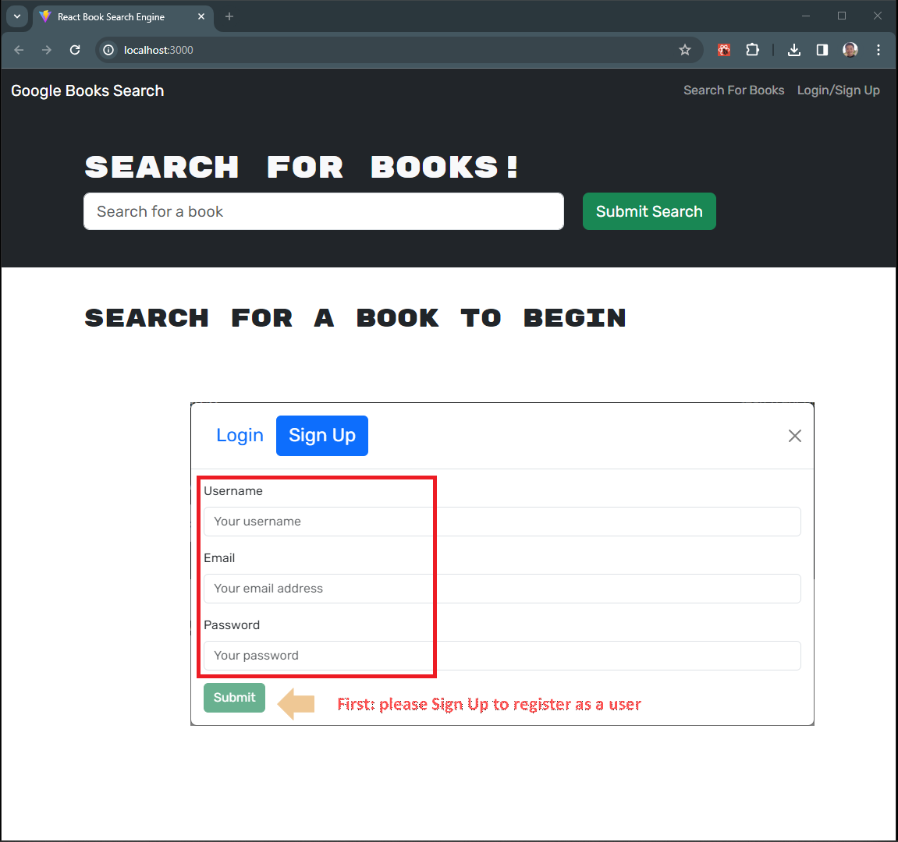

# Search-Engine-withGraphQL

## Description

This Application is a book search and storage site that is built by using the MERN stack. The application was already built but was built using RESTful API. I successfully refactored this application to be a GraphQL API built with Apollo Server.

To see how this search engine works, see the **walk-through demonstration videos** here:[Click!](https://github.com/HuiPan-Peter/Search-Engine-withGraphQL/tree/main/assets)

## Table of Contents

- [Application Preview](#application-preview)
- [Installation](#installation)
- [Usage](#usage)
- [Contribution](#contribution)
- [Questions](#questions)

## Application Preview

## Installation

- Download or clone the repository to use this application on your local machine.
- `Apollo`, `MongoDB` and `GraphQL` are required to run the application, and check all the dependencies.
- To install the necessary dependencies, navigate to the root directory and run the following command:
  `npm install`

## Usage

For more information - Please visit the walkthrough demo on how the application works.
[Demo Video](https://github.com/HuiPan-Peter/Search-Engine-withGraphQL/blob/main/assets/Search%20Engine%20Walkthrough%20Video.mp4)

#### Starting the Server

After installation :
- run the command `npm run build` which will run the Vite build process which will bundle the React source code.
- run the command `npm run develop` which will execute the vite, which starts the development server provided by Vite, and allows users to run the code on their local host.
- After a Sign-Up register as a user, you can start to explore how this search engine works.

## Contributing

I welcome contributions from the community to help improve and extend the Search Engine. To contribute please fork this repository, create your own branch, make your changes. 

If you have questions or need assistance don't hesitate to contact me via GitHub!

GitHub: [HuiPan-Peter](https://github.com/HuiPan-Peter)

## Questions

📩 If you have any questions, email me here at: guaranstone@gmail.com
